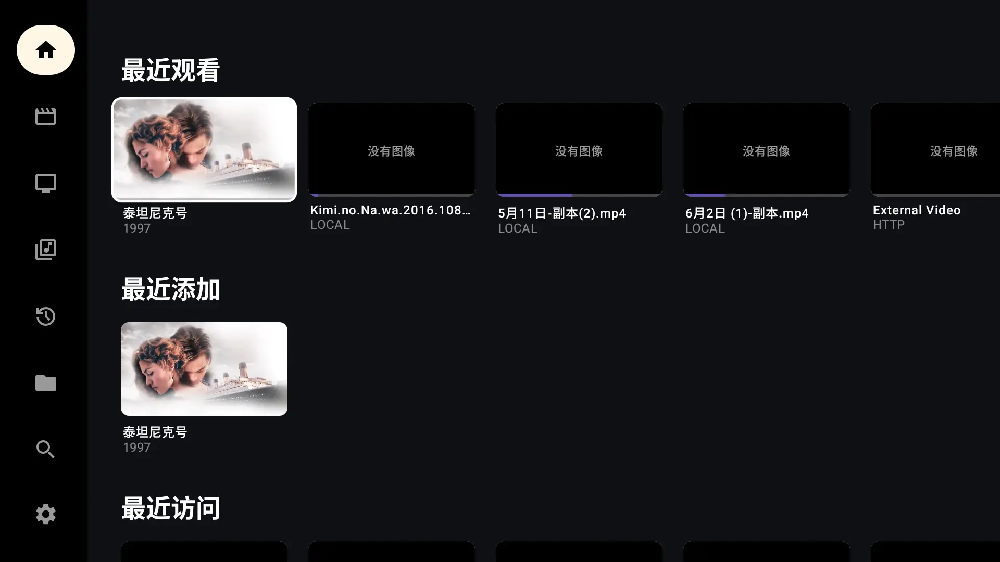
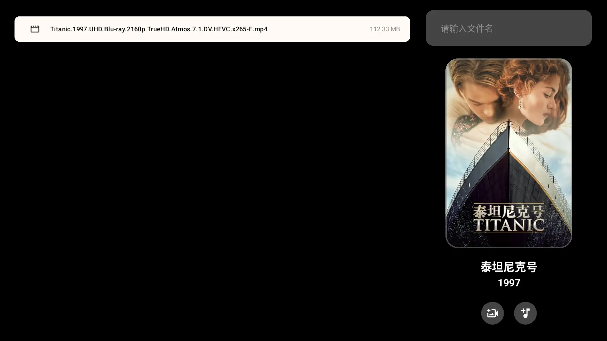
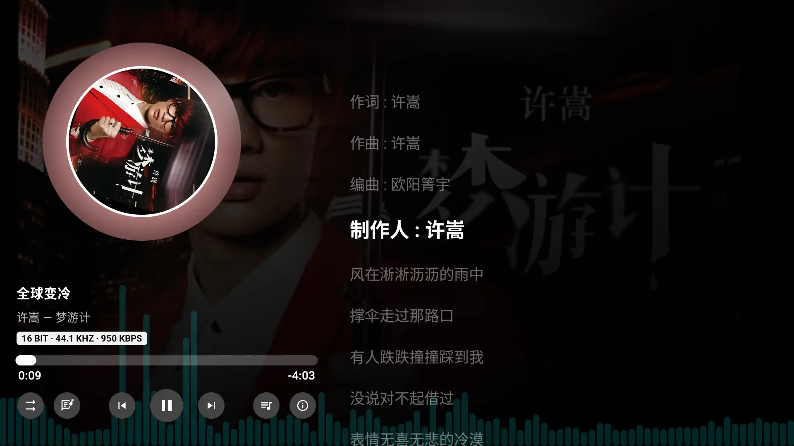
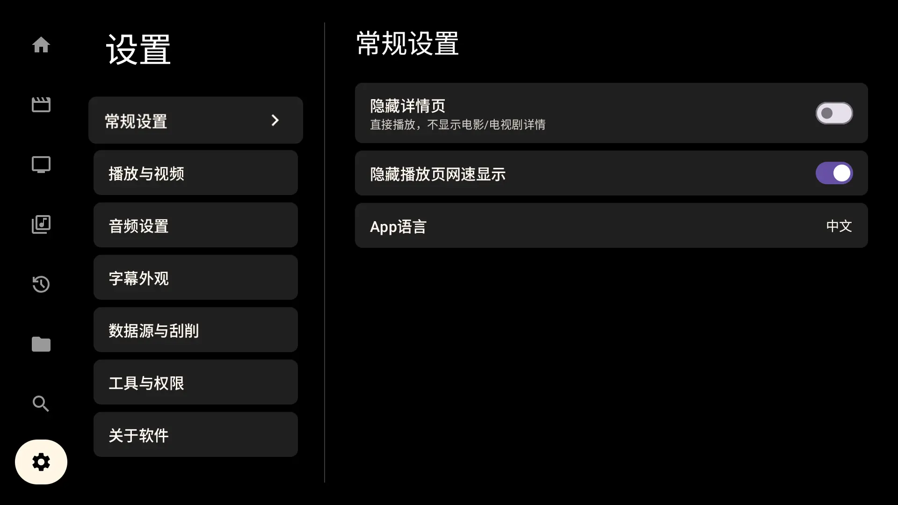

# MzDKPlayer - Android TV Local Danmaku Media Player

[中文](README.md) | English
> GitHub https://github.com/mzhsy1/MzDKPlayer Gitee Mirror https://gitee.com/mzhsy/MzDKPlayer

> MzDKPlayer is a local music and video player specifically designed for Android TV, supporting danmaku (bullet comments), multiple network protocols, and various audio/video formats.

---

## Features

### Core Features

- 🎬 **Video Playback** - Supports various video formats for local and network protocol playback.
- 🎵 **Audio Playback** - Supports various audio formats for local and network protocol playback. Includes lyrics, album cover display, music information, playlists, and other common features.
- 🖼️ **Image Viewer** - Supports various image formats for local and network protocol viewing.
- 🏡 **Media Library** - Includes Movie/TV/Music libraries, fetching information from TMDB, supporting batch addition.
- 🕛 **History** - Playback history for both audio and video.
- 🔍 **Search Function** - Search for movies and TV shows.
- 💬 **Danmaku Function** - Supports Bilibili-style danmaku display and customization.
- ⚙️ **Settings** - Detailed application and playback settings.
- 🌐 **Network Protocol Support**:
  - ✅ SMB protocol (Supported)
  - ✅ FTP protocol (Supported)
  - ✅ WebDAV protocol (Supported; Note: LAN WebDAV services like those from Feiniu NAS may only support HTTP, while public clouds like Aliyun support HTTPS).
  - ✅ NFS protocol (Supported)
  - ✅ HTTP protocol (Supported via NGINX servers)
- 🎚️ **Track Selection** - Supports switching audio, video, and subtitle tracks, playback speed control, and audio software/hardware decoding.

### 🔊 Advanced Playback: Audio Passthrough

MzDKPlayer supports audio passthrough, allowing raw audio signals (source) to be output directly to an amplifier, soundbar, or TV that supports multi-channel decoding for a cinema-grade listening experience.

* **Path**: `Settings` -> `Audio Settings` -> `Audio Passthrough`
* **Applicability**: **This toggle only affects the VLC playback engine**. The ExoPlayer engine will automatically determine this based on your device, no manual intervention needed.
* **Suggestions**:
* **Default State**: Recommended to keep it **Off**. ExoPlayer already meets the automatic adaptation needs of most devices.
* **Prerequisites**: Only enable this if you have an external amplifier or high-end audio decoding device and are certain it supports the audio encoding format (e.g., DTS-HD, TrueHD) of the video being played.
* **Troubleshooting**: If you encounter **no sound** during playback after enabling, it means your audio device does not support the current video's audio track format (e.g., some TVs do not support TrueHD passthrough). **In this case, please turn off this toggle** to let the player output via PCM through software decoding.

### Format Support

#### 📺 Video Formats

* **Common Containers**: MP4, MKV, MOV, AVI, WMV, FLV, WebM
* **Blu-ray/Professional Formats**: **ISO (Blu-ray Image)**, **M2TS**, **MTS**, TS, VOB
* **Video Encodings**: H.264 (AVC), **H.265 (HEVC)**, **AV1**, VP9, MPEG-2
* **Feature Support**: 4K/8K UHD playback, HDR10/HLG, Dolby Vision

#### 🎵 Audio Formats

* **Lossless/Hi-Fi**: **FLAC**, WAV, ALAC (Apple Lossless)
* **General Formats**: MP3, AAC, OGG, Opus, WMA
* **Cinema-grade Tracks**: **DTS**, **DTS-HD**, **TrueHD**, AC3 (Dolby Digital), E-AC3

#### 🖼️ Image Formats

* **Standard Formats**: JPEG (JPG), PNG, WebP, BMP
* **Modern Formats**: HEIC / HEIF
* *Note: Apple Live Photos are currently not supported.*

#### 💬 Subtitle Support

* **External Subtitles**: **SRT**, **ASS**, **SSA**, VTT
* **Embedded Subtitles**: MKV Internal, **PGS (Blu-ray Subtitles)**, DVB, Teletext

---

> ⚠️ **Note**: TMDB may require a proxy or Host modification for stable access in some regions.

> 💡 Tip 1: If used frequently, it's recommended to set this player as the default video player in your TV system for a smoother experience.

> 💡 Tip 2: If device performance is insufficient, enabling danmaku while playing 70-80GB Blu-ray videos may cause playback lag.

> 💡 Tip 3: If you encounter issues with the default ExoPlayer engine, you can try switching to the VLC player engine in `Settings` -> `Playback & Video` -> `Default Player Engine`.

---

## App Preview

### Main Interface & File List

### Playback Interface & Danmaku

  

### Movie/TV Details Page

### Settings Page

---

## Technical Architecture

### Key Tech Stack

- **Media Playback**: ExoPlayer + Custom Extensions
- **UI Framework**: Jetpack Compose for TV
- **Danmaku Engine**: AKDanmaku
- **Subtitle Rendering**: ASS Subtitle Library
- **Network Protocols**: Custom SMB/FTP/WebDAV client implementations

### Core Components

- `VideoPlayerScreen` - Main player interface
- `BuilderMzPlayer` - Player construction and configuration
- `AkDanmakuPlayer` - Danmaku playback component
- `MovieDetailsScreen` / `TVSeriesDetailsScreen` - Movie/TV show details pages
- `FullDescriptionDialog` - Detailed description popup dialog

---

## Hardware Requirements

### Recommended

- **Chipset**: Amlogic S928X-J
- **RAM**: 4GB and above
- **System**: Android TV 11 and above

### Balanced

- **Chipset**: MT9653 or equivalent performance chipset
- **RAM**: 2GB RAM
- **System**: Android TV 7 and above

### Minimum

- **Chipset**: Amlogic S905L or equivalent performance chipset
- **RAM**: 1GB RAM
- **System**: Android TV 7 and above

> ⚠️ **Note**: The code is not well-optimized; it's a success if it runs. There are bugs. Insufficient device performance may cause video and danmaku playback lag, or failure to play high-bitrate videos.

---

## Build, Installation & Usage

### Build Requirements

- Latest version of Android Studio
- Android SDK 36+
- Java 17

### Build Steps

1. Clone the project locally
2. Open the project with Android Studio
3. Connect an Android TV device with ADB debugging enabled
4. Build and run the application

### Basic Usage

1. Select a video file (local or network) on the main interface; the player will automatically look for an XML danmaku file with the same name in the same directory.
2. Control the playback interface using the remote:
   - Left/Right keys: Fast forward / Rewind
   - OK key: Pause / Play
   - Menu key: Show control interface
   - Remote Up key: Danmaku settings; Down key: Audio track selection
3. Click a video file to view movie/TV series details (including poster, summary, rating, year, country, genre, etc.)

---

## Project Status

⚠️ **Development Phase**: Initial stage, known bugs exist

### Recent Development Plans

- [x] FTP protocol support
- [x] WebDAV protocol support
- [x] NFS protocol support
- [x] Audio file and image file support
- [x] Playlist management
- [x] Movie/TV series details page
- [ ] Online danmaku loading function
- [ ] Settings interface optimization

---

## Contributing

Contributions via Issues and Pull Requests are welcome to help improve this project. Contributions to **player stability** are especially welcome!

---

## Disclaimer

This software is for learning and exchange purposes only; please do not use it for commercial purposes. The developer is not responsible for any issues caused by the use of this software.

---

**Note**: Normal use of features like Dolby Vision, Dolby Atmos, and DTS-HD requires device hardware support. Some features may require specific audio/video equipment for the best experience.
